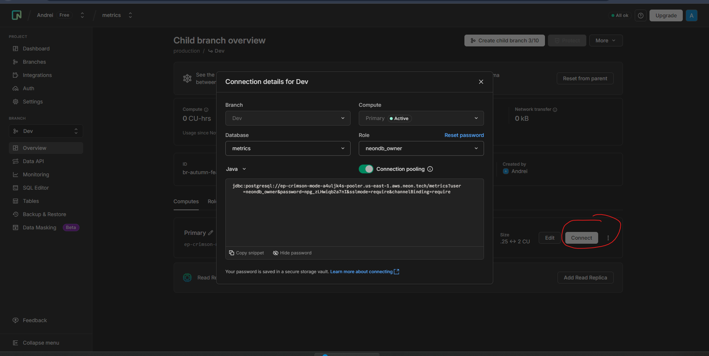
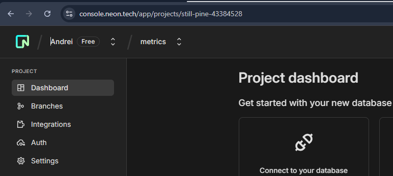
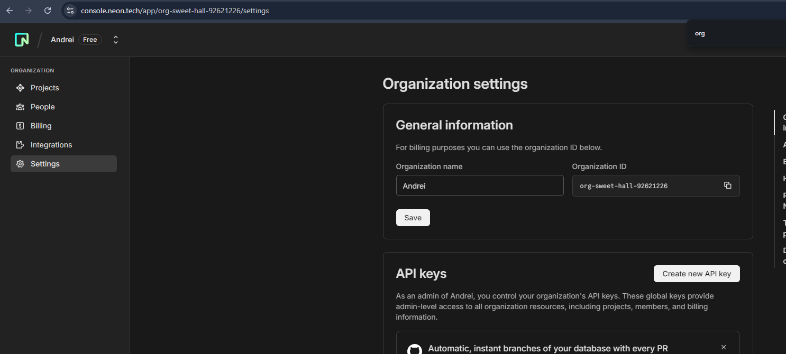
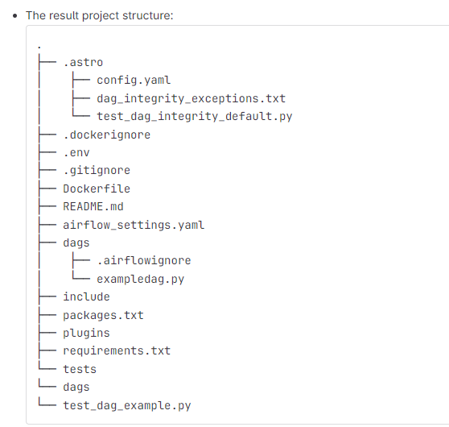
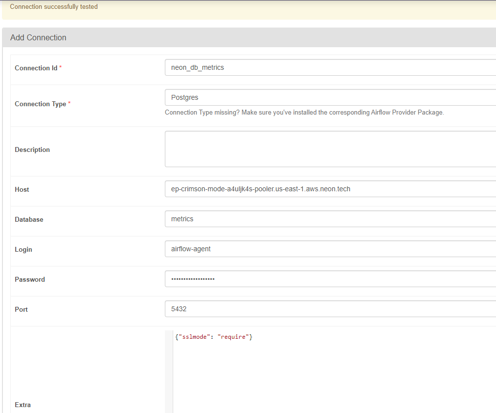

# Step 1 NeonDB setup

NeonDB

a.rohau.work

https://console.neon.tech/app/projects/still-pine-43384528

https://console.neon.tech/app/projects/still-pine-43384528/branches/br-autumn-feather-a4vu1uh1/

---
Dev branch
connection string
```

jdbc:postgresql://ep-crimson-mode-a4uljk4s-pooler.us-east-1.aws.neon.tech/metrics?user=neondb_owner&password=**************&sslmode=require&channelBinding=require
```
passwordless auth
```
psql -h pg.neon.tech
```


---
Install NeonDB Cli

```shell
npm install -g neonctl
neonctl --version
neon auth
```
```commandline
INFO: Awaiting authentication in web browser.
INFO: Auth Url: https://oauth2.neon.tech/oauth2/auth?scope=openid....
INFO: Auth complete
```

Auth data is saved here: ```C:\Users\<user>\.config\neonctl\credentials.json```


Project 'metrics' id 'still-pine-43384528'

Organization 'Andrei' id 'org-sweet-hall-92621226'



```commandline
neonctl branches create --name Dev --org-id org-sweet-hall-92621226 --project-id still-pine-43384528
OR
neonctl branches create --name Dev --organization-id org-sweet-hall-92621226 --project-id still-pine-43384528
```


---
# Step 2 Airflow project setup

- install Astro CLI 
- - https://github.com/astronomer/astro-cli/releases
- - located: "C:\localprogs\astronomer" as astro.exe and astro_1.38.1_windows_amd64.exe
- - addede env var: ASTRONOMER_HOME and path %ASTRONOMER_HOME%
- - Close IDEA (restart doesnt work)
- validate astro version
- - in cmd "astro version" -> 1.38.1


Initialization: go to project root dir
```commandline
mkdir airflow
cd airflow
astro dev init
```


Modify Dockerfile to allow testing of the connection
```
FROM quay.io/astronomer/astro-runtime:12.2.0
# Set environment variables
ENV AIRFLOW__CORE__TEST_CONNECTION=Enabled
```


Modify requirement.txt and include dbt-cloud
```
apache-airflow-providers-dbt-cloud==3.10.0
```

#### Run Airflow
- put a sample DAG to the `dags` folder - for example, use [this snippet](https://github.com/sungchun12/airflow-dbt-cloud/blob/main/dags/example-dag.py)
- from the root folder of you project, execute the following command: `astro dev start`
- wait until all the images are downloaded and Airflow is started - may take up to 10 minutes for the first time
- test that Airflow admin UI is available at `localhost:8080`
- try running your sample DAG
- keep in mind the following [Astro CLI command reference](https://www.astronomer.io/docs/astro/cli/reference)

---
# Step 3 - Airflow-NeonDB integration

```
cd /home/arohau/vscode_space/learn/big-data-run/Data-for-Java-Developers-Mentoring-Program-4-2025-Q4/module-4-task/airflow-project-setup/airflow && astro dev start
```

### Create a role for Airflow:

- open NeonDB SQL editor - make sure to choose your Dev branch and metrics DB
- create a airflow-agent role
- make sure to grant it the CREATE privileges on the metrics schema

```
CREATE ROLE "airflow-agent" WITH PASSWORD 'agent_password#007' LOGIN CREATEDB CREATEROLE;
CREATE SCHEMA IF NOT EXISTS metrics;
GRANT USAGE ON SCHEMA metrics TO "airflow-agent";
GRANT CREATE ON SCHEMA metrics TO "airflow-agent";
```

### Create a DB connection in Airflow

#### Steps to Create NeonDB Connection in Airflow UI:
1. Open Airflow UI at http://localhost:8080 in your Windows Chrome browser
2. Login with admin / admin
3. Navigate to Connections:
    - Click on **Admin** in the top menu
    - Select **Connections** from the dropdown
4. Add a New Connection - Click the + (plus) button
5. Fill in the Connection Details:
    - Connection Id: neon_db (or your preferred name)
    - Connection Type: Select Postgres from the dropdown
    - Host: Your NeonDB hostname (from Neon console, looks like: xxx-xxx-xxx.neon.tech)
    - Schema: Your database name (e.g., neondb or main)
    - Login: airflow-agent (the role name you created)
    - Password: The password for your airflow-agent role
    - Port: 5432 (default PostgreSQL port)
    - Extra: (Optional) Add SSL settings:
    ```
    {"sslmode": "require"}
    ```
6. Test the Connection:
    - Click the Test button at the bottom
    - Make sure you see a success message with no errors
7. Save the connection




Generate dag, prepare sqls

```
SELECT tablename
FROM pg_tables
WHERE schemaname = 'metrics';
```

---
# Step 4 - data ingestion setup

## Prepare test data
- generate the test data
    - find out how to run the test data generator [here](../../aws/TEST_DATA.md) - the "Basic usage" and "CSV-formatted metrics" sections
    - run the test data generator from [here](../../aws/materials/test-data-generator-prebuilt) - use or customise the `metrics-batch.json` task config, f.e. ` java -jar test-data-generator-1.0.0-all.jar metrics-batch.json`
- copy the resulting data from `test-output` to the `dags/data` folder of your Airflow project

## Implement ingestion
- create a new DAG - `data-quality-pipeline`
    - add a step for installing Python dependencies
    - add a step which
        - connects to the DB - see the sample code from step 3
        - iterates over the files in the `dags/data` folder
        - copies each file to the DB, commits, and moves the file to the `processed` folder
    - hints
        - use the [COPY statement](https://www.postgresql.org/docs/current/sql-copy.html) with [this from the Psycopg library](https://www.psycopg.org/docs/cursor.html#cursor.copy_expert)
        - do not forget to commit the transaction
        - use [this](https://medium.com/@rajatbelgundi/efficient-etl-cleaning-transforming-and-loading-csv-data-in-postgresql-with-airflow-in-a-0bf062a0ed41) to see an example of how to upload CSVs to PostgreSQL
- run the DAG and make sure the data appears in NeonDB by querying it there. Both csv files should be imported.
  ```sql
  set schema 'metrics';

  select component_name, count(1) as "amount" from metrics
  group by component_name;
```

clear database
```
docker exec airflow_c5149d-webserver-1 bash -c 'python3 << "PYEOF"
from airflow.providers.postgres.hooks.postgres import PostgresHook
hook = PostgresHook(postgres_conn_id="neon_db_metrics")
conn = hook.get_conn()
cursor = conn.cursor()

# Clear ALL data
cursor.execute("TRUNCATE TABLE metrics.windowed_metrics RESTART IDENTITY;")
conn.commit()

# Verify empty
cursor.execute("SELECT COUNT(*) FROM metrics.windowed_metrics")
count = cursor.fetchone()[0]
print(f"Database cleared. Current record count: {count}")

cursor.close()
conn.close()
PYEOF
'
```


# Step 5 - DBT model setup

BigDataTraining
70471823513242

https://yh704.us1.dbt.com/70471823513242/projects/70471823529326/setup
a.rohau.work
Hint 123454321Qq!

```
cat << 'SQL' > /tmp/dbt_setup.sql
-- Create DBT role
CREATE ROLE "dbt-agent" WITH PASSWORD 'dbt_password#007' LOGIN;

-- Grant schema access
GRANT USAGE ON SCHEMA metrics TO "dbt-agent";
GRANT SELECT ON ALL TABLES IN SCHEMA metrics TO "dbt-agent";
GRANT CREATE ON SCHEMA metrics TO "dbt-agent";

-- Grant future table permissions
ALTER DEFAULT PRIVILEGES IN SCHEMA metrics 
GRANT SELECT ON TABLES TO "dbt-agent";

-- Verify the role
SELECT rolname, rolcanlogin FROM pg_roles WHERE rolname = 'dbt-agent';
SQL
cat /tmp/dbt_setup.sql
```


