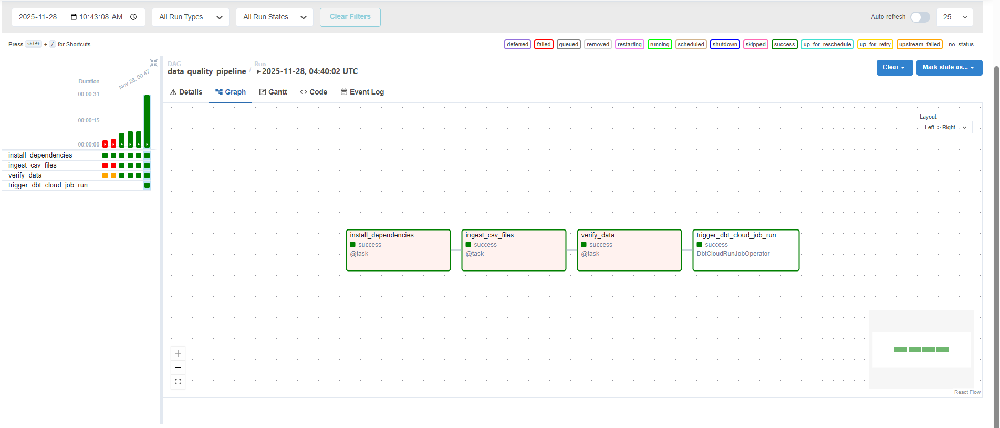
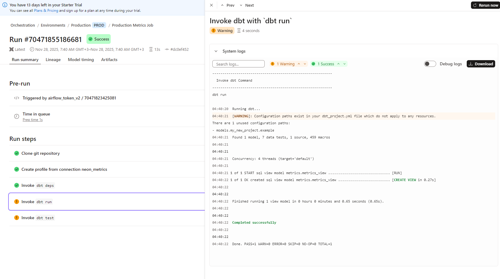
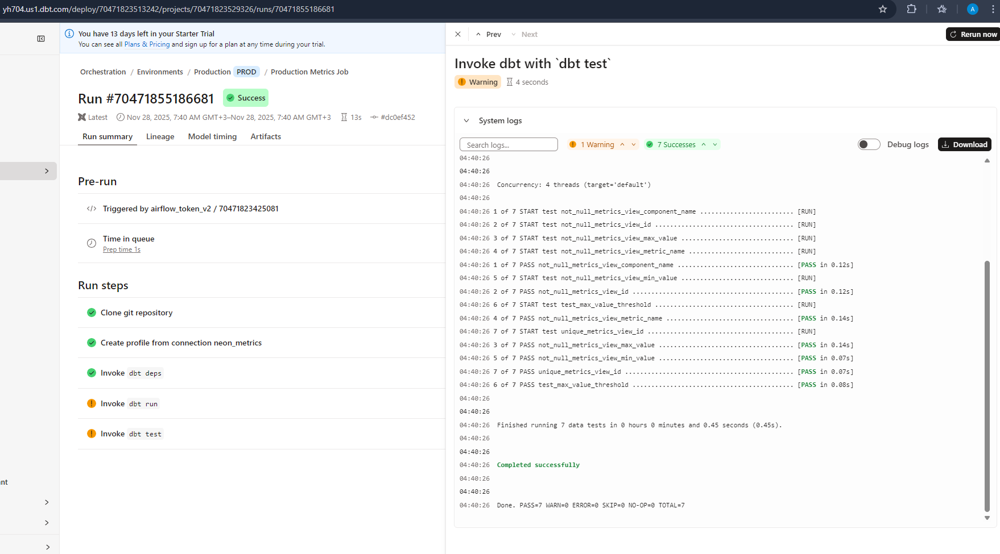

# Resutls demovideo

demo video [link](https://epam-my.sharepoint.com/:v:/r/personal/andrei_rohau_epam_com/Documents/Recordings/video-20251130_201426-Meeting%20Recording.mp4?csf=1&web=1&e=PpPw6g&nav=eyJyZWZlcnJhbEluZm8iOnsicmVmZXJyYWxBcHAiOiJTdHJlYW1XZWJBcHAiLCJyZWZlcnJhbFZpZXciOiJTaGFyZURpYWxvZy1MaW5rIiwicmVmZXJyYWxBcHBQbGF0Zm9ybSI6IldlYiIsInJlZmVycmFsTW9kZSI6InZpZXcifX0%3D)

-repo self [link](https://github.com/AndreiRohau/Data-for-Java-Developers-Mentoring-Program-4-2025-Q4#)
- guide [link](https://git.epam.com/epm-cdp/global-java-foundation-program/java-courses/-/blob/main/data-training-for-devs/courses/Data_Training_for_Java_developers/apache-airflow/tasks/task.md)
- neon [link](https://console.neon.tech/app/projects/still-pine-43384528/branches/br-autumn-feather-a4vu1uh1/sql-editor?database=metrics&query=v3#plan)
- airflow [link](http://localhost:8080/home?tags=data-ingestion)
- dbt [link](https://yh704.us1.dbt.com/deploy/70471823513242/projects/70471823529326/jobs/70471823534131)

# Step 1 NeonDB setup

NeonDB

a.rohau.work

https://console.neon.tech/app/projects/still-pine-43384528

https://console.neon.tech/app/projects/still-pine-43384528/branches/br-autumn-feather-a4vu1uh1/

---
Dev branch
connection string
```

jdbc:postgresql://ep-crimson-mode-a4uljk4s-pooler.us-east-1.aws.neon.tech/metrics?user=neondb_owner&password=**************&sslmode=require&channelBinding=require
```
passwordless auth
```
psql -h pg.neon.tech
```


---
Install NeonDB Cli

```shell
npm install -g neonctl
neonctl --version
neon auth
```
```commandline
INFO: Awaiting authentication in web browser.
INFO: Auth Url: https://oauth2.neon.tech/oauth2/auth?scope=openid....
INFO: Auth complete
```

Auth data is saved here: ```C:\Users\<user>\.config\neonctl\credentials.json```


Project 'metrics' id 'still-pine-43384528'

Organization 'Andrei' id 'org-sweet-hall-92621226'


```commandline
neonctl branches create --name Dev --org-id org-sweet-hall-92621226 --project-id still-pine-43384528
OR
neonctl branches create --name Dev --organization-id org-sweet-hall-92621226 --project-id still-pine-43384528
```


---
# Step 2 Airflow project setup

- install Astro CLI 
- - https://github.com/astronomer/astro-cli/releases
- - located: "C:\localprogs\astronomer" as astro.exe and astro_1.38.1_windows_amd64.exe
- - addede env var: ASTRONOMER_HOME and path %ASTRONOMER_HOME%
- - Close IDEA (restart doesnt work)
- validate astro version
- - in cmd "astro version" -> 1.38.1


Initialization: go to project root dir
```commandline
mkdir airflow
cd airflow
astro dev init
```


Modify Dockerfile to allow testing of the connection
```
FROM quay.io/astronomer/astro-runtime:12.2.0
# Set environment variables
ENV AIRFLOW__CORE__TEST_CONNECTION=Enabled
```


Modify requirement.txt and include dbt-cloud
```
apache-airflow-providers-dbt-cloud==3.10.0
```

#### Run Airflow
- put a sample DAG to the `dags` folder - for example, use [this snippet](https://github.com/sungchun12/airflow-dbt-cloud/blob/main/dags/example-dag.py)
- from the root folder of you project, execute the following command: `astro dev start`
- wait until all the images are downloaded and Airflow is started - may take up to 10 minutes for the first time
- test that Airflow admin UI is available at `localhost:8080`
- try running your sample DAG
- keep in mind the following [Astro CLI command reference](https://www.astronomer.io/docs/astro/cli/reference)

---
# Step 3 - Airflow-NeonDB integration

```
cd /home/arohau/vscode_space/learn/big-data-run/Data-for-Java-Developers-Mentoring-Program-4-2025-Q4/module-4-task/airflow-project-setup/airflow && astro dev start
```

### Create a role for Airflow:

- open NeonDB SQL editor - make sure to choose your Dev branch and metrics DB
- create a airflow-agent role
- make sure to grant it the CREATE privileges on the metrics schema

```
CREATE ROLE "airflow-agent" WITH PASSWORD 'agent_password#007' LOGIN CREATEDB CREATEROLE;
CREATE SCHEMA IF NOT EXISTS metrics;
GRANT USAGE ON SCHEMA metrics TO "airflow-agent";
GRANT CREATE ON SCHEMA metrics TO "airflow-agent";
```

### Create a DB connection in Airflow

#### Steps to Create NeonDB Connection in Airflow UI:
1. Open Airflow UI at http://localhost:8080 in your Windows Chrome browser
2. Login with admin / admin
3. Navigate to Connections:
    - Click on **Admin** in the top menu
    - Select **Connections** from the dropdown
4. Add a New Connection - Click the + (plus) button
5. Fill in the Connection Details:
    - Connection Id: neon_db (or your preferred name)
    - Connection Type: Select Postgres from the dropdown
    - Host: Your NeonDB hostname (from Neon console, looks like: xxx-xxx-xxx.neon.tech)
    - Schema: Your database name (e.g., neondb or main)
    - Login: airflow-agent (the role name you created)
    - Password: The password for your airflow-agent role
    - Port: 5432 (default PostgreSQL port)
    - Extra: (Optional) Add SSL settings:
    ```
    {"sslmode": "require"}
    ```
6. Test the Connection:
    - Click the Test button at the bottom
    - Make sure you see a success message with no errors
7. Save the connection


Generate dag, prepare sqls

```
SELECT tablename
FROM pg_tables
WHERE schemaname = 'metrics';
```

---
# Step 4 - data ingestion setup

## Prepare test data
- generate the test data
    - find out how to run the test data generator [here](../../aws/TEST_DATA.md) - the "Basic usage" and "CSV-formatted metrics" sections
    - run the test data generator from [here](../../aws/materials/test-data-generator-prebuilt) - use or customise the `metrics-batch.json` task config, f.e. ` java -jar test-data-generator-1.0.0-all.jar metrics-batch.json`
- copy the resulting data from `test-output` to the `dags/data` folder of your Airflow project

## Implement ingestion
- create a new DAG - `data-quality-pipeline`
    - add a step for installing Python dependencies
    - add a step which
        - connects to the DB - see the sample code from step 3
        - iterates over the files in the `dags/data` folder
        - copies each file to the DB, commits, and moves the file to the `processed` folder
    - hints
        - use the [COPY statement](https://www.postgresql.org/docs/current/sql-copy.html) with [this from the Psycopg library](https://www.psycopg.org/docs/cursor.html#cursor.copy_expert)
        - do not forget to commit the transaction
        - use [this](https://medium.com/@rajatbelgundi/efficient-etl-cleaning-transforming-and-loading-csv-data-in-postgresql-with-airflow-in-a-0bf062a0ed41) to see an example of how to upload CSVs to PostgreSQL
- run the DAG and make sure the data appears in NeonDB by querying it there. Both csv files should be imported.
  ```sql
  set schema 'metrics';

  select component_name, count(1) as "amount" from metrics
  group by component_name;
```

clear database
```
docker exec airflow_c5149d-webserver-1 bash -c 'python3 << "PYEOF"
from airflow.providers.postgres.hooks.postgres import PostgresHook
hook = PostgresHook(postgres_conn_id="neon_db_metrics")
conn = hook.get_conn()
cursor = conn.cursor()

# Clear ALL data
cursor.execute("TRUNCATE TABLE metrics.windowed_metrics RESTART IDENTITY;")
conn.commit()

# Verify empty
cursor.execute("SELECT COUNT(*) FROM metrics.windowed_metrics")
count = cursor.fetchone()[0]
print(f"Database cleared. Current record count: {count}")

cursor.close()
conn.close()
PYEOF
'
```


# Step 5 - DBT Model Setup ✅

## ✅ Create a role for DBT
Created `dbt-agent` role in NeonDB:
```sql
CREATE ROLE "dbt-agent" WITH PASSWORD 'dbt_password#007' LOGIN;
GRANT USAGE ON SCHEMA metrics TO "dbt-agent";
GRANT CREATE ON SCHEMA metrics TO "dbt-agent";

-- Critical: Grant role membership to access airflow-agent's tables
GRANT "airflow-agent" TO "dbt-agent";
```

## ✅ Set up a DBT Cloud project
- **Account**: BigDataTraining (ID: 70471823513242)
- **Project**: metrics_project (ID: 70471823529326)
- **URL**: https://yh704.us1.dbt.com/70471823513242/projects/70471823529326/setup
- **Connection**: neon_metrics
  - Host: ep-crimson-mode-a4uljk4s-pooler.us-east-1.aws.neon.tech
  - Port: 5432
  - Database: metrics
  - Schema: metrics
  - User: dbt-agent
- **Git Integration**: GitHub repository connected
  - Repo: AndreiRohau/Data-for-Java-Developers-Mentoring-Program-4-2025-Q4
  - Subdirectory: module-4-task/dbt-project
  - Deploy key added to GitHub
- **Development Environment**: ✅ Created with 6 threads
- **Production/Deployment Environment**: ✅ Created
- **Development Credentials**: ✅ Configured (dbt-agent)

## ✅ Create a DBT model
- **Model**: `metrics_view.sql` (view of windowed_metrics table)
- **Branch**: development branch created
- **Columns**: id, component_name, metric_name, unit, min_value, max_value, from_timestamp, to_timestamp, created_at
- **Materialization**: VIEW
- **Status**: ✅ Committed and merged to main
- **Deployment**: ✅ Automatically promoted to production environment

## ✅ Create a DBT job
- **Job Name**: Production Metrics Job
- **Environment**: Production (deployment)
- **Commands**: 
  - `dbt run` - Build models
  - `dbt test` - Run tests
- **Status**: ✅ Job created and runs successfully
- **Results**: 
  - dbt run: 1 model built (PASS=1)
  - dbt test: 7 tests passed (PASS=7)
- **Runtime**: ~0.5 seconds

## ✅ Create data tests
### Schema Tests (in `schema.yml`):
- ✅ `not_null` tests on: id, component_name, metric_name, min_value, max_value
- ✅ `unique` test on: id
- **Status**: All 6 schema tests PASS

### Custom Threshold Test (`tests/test_max_value_threshold.sql`):
```sql
-- Test that max_value doesn't exceed threshold
SELECT
    component_name,
    metric_name,
    max_value
FROM {{ ref('metrics_view') }}
WHERE max_value > 1000  -- Configurable threshold
```
- ✅ **Test with threshold > 50**: FAILS (correctly finds max_value=500)
- ✅ **Test with threshold > 1000**: PASSES (no values exceed threshold)
- ✅ **Rollback**: Changed threshold back to 1000
- ✅ **Final Status**: Test PASSES in production job

## DBT Cloud Setup Complete

### Created Resources:
1. **DBT Project**: metrics_project (ID: 70471823529326)
2. **Connection**: neon_metrics (PostgreSQL to NeonDB)
3. **Environments**:
   - Development: For model development and testing
   - Production: For deployment
4. **GitHub Integration**: Connected to Data-for-Java-Developers-Mentoring-Program-4-2025-Q4
5. **Subdirectory**: module-4-task/dbt-project

### DBT Models:
- **metrics_view.sql**: View model of windowed_metrics table
  - Materialized as: VIEW
  - Columns: id, component_name, metric_name, unit, min_value, max_value, from_timestamp, to_timestamp, created_at
  - Ordered by: from_timestamp DESC, component_name, metric_name

### DBT Tests:
1. **Schema tests** (in schema.yml):
   - not_null tests on: id, component_name, metric_name, min_value, max_value
   - unique test on: id
2. **Custom test** (test_max_value_threshold.sql):
   - Validates max_value against configurable threshold
   - Test with threshold > 50: FAILS (finds 500 in data)
   - Test with threshold > 1000: PASSES (no values exceed)

### Permission Configuration:
```sql
-- Critical permission fix for dbt-agent to access airflow-agent's tables
GRANT "airflow-agent" TO "dbt-agent";
```

### DBT Job Results:
- **Production Job**: Successfully runs dbt run + dbt test
- **Status**: All 7 tests PASS
  - 6 schema tests (not_null, unique)
  - 1 custom threshold test
- **Runtime**: ~0.5 seconds

### Commands Used:
```bash
# In DBT Cloud IDE
dbt debug              # Verify connection
dbt run                # Build models
dbt test               # Run all tests
dbt test --select test_max_value_threshold  # Run specific test
```










